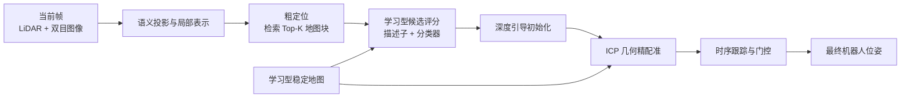

# 仓库机器人跨日期定位系统

> 用 LiDAR、双目图像、语义信息和学习模型，让移动机器人在“货架会重复、物体会移动、日期会变化”的仓库里重新找到自己。

<p align="center">
  
  
  
  
</p>

## 一句话说明

这是一个面向仓储机器人的**粗到精跨日期重定位系统**。系统先从大地图中找出少量可能区域，再结合深度匹配、几何配准和时序跟踪给出精确位姿；同时学习“地图中哪些位置长期可靠”，降低人员、推车和场景变化对定位的影响。

项目的核心不是单一模型，而是一套从**数据读取、跨模态对齐、候选检索、学习评分、几何求解、失败分析到可复现实验**的完整工程闭环。

## 结果速览

所有数字均来自固定训练/测试划分，详细定义见 [结果与复现说明](docs/RESULTS_AND_REPRODUCIBILITY.md)。

| 模块 | 测试设置 | 结果 | 说明 |
| --- | --- | ---: | --- |
| 粗定位候选分类 | Jun.15 训练 → Oct.12 Aisle_CCW 测试 | **Top-1 44.26%** | 直接命中正确地图块的比例 |
| 粗定位召回 | 同上 | **Recall@3 76.72%** | 正确块位于前三候选的比例 |
| 精定位 | Oct.12 Aisle_CCW 全序列 | **0.1086 m** 平均位置误差 | 98.47% 帧小于 0.5 m |
| 精定位 | Oct.12 Aisle_CW 全序列 | **0.0932 m** 平均位置误差 | 99.08% 帧小于 0.5 m |
| Aisle 合并精度 | 两条路线合并 | **0.1002 m** 平均位置误差 | 98.80% 帧小于 0.5 m |
| 学习型地图 | 跨日空间隔离验证 | **MAE 0.1914 → 0.1096** | 比人工稳定性公式降低 **42.7%** |

<p align="center">
  
</p>

## 系统如何工作



### 1. 粗定位：先缩小搜索范围

把当前 LiDAR 扫描转换为鸟瞰表示，再与六月地图中的候选块进行匹配。网络同时学习全局描述子和“当前帧属于哪个地图块”的分类分数，解决仓库中外观相似货架带来的混淆。

### 2. 精定位：再用深度学习与几何互补

对 Top-K 候选，深度网络给出匹配可信度与初始相对位姿；ICP 利用点云几何进一步对齐。这样的分工避免只依赖学习模型，也避免 ICP 从全局搜索时陷入错误的重复货架。

### 3. 时序稳定：不让单帧异常带偏轨迹

系统保留当前跟踪状态与有竞争力的候选状态。候选只有在连续多帧证据支持下才切换；当图像被人或推车遮挡时，可靠性门控会降低不稳定初始化的影响。

### 4. 学习型地图：判断“哪里值得信任”

系统将 LiDAR 点投影到左右语义图，再构建 0.5 m 栅格地图。轻量卷积网络读取中心栅格周围的局部结构、观测密度和语义分布，预测该位置跨日期后是否仍适合定位。

<p align="center">
  
  
</p>

### 跨模态对齐：把“看见的东西”投到地图坐标里

<p align="center">
  
  
</p>

<p align="center">
  
</p>

## 我解决了什么工程问题

| 现实难点 | 处理方式 | 收获 |
| --- | --- | --- |
| 货架高度重复，直接全局 ICP 容易对齐到错误位置 | 先检索候选块，再在 Top-K 内精配准 | 将全局搜索拆成可控的分阶段问题 |
| 人员和推车遮挡局部环境 | 语义投影、动态区域过滤、时序门控 | 保留稳定历史状态，避免单帧异常触发跳变 |
| 地图会跨日期变化 | 用 Jun.15 初始图预测 Jun.23 再观测可靠性 | 从人工规则升级为可学习的可靠性地图 |
| 深度模型和几何模型各有盲区 | 深度网络提供候选/初始化，ICP 负责最终几何约束 | 形成可解释、可回退的混合系统 |

## AI 辅助科研与工程能力

本项目展示的不是“调用一个现成模型”，而是把 AI 用于完整问题求解：

- **提出可检验假设**：从误差曲线、错误候选和遮挡帧中定位瓶颈，再设计候选分类、时序门控与地图可靠性等针对性机制。
- **跨模态建模**：把点云、双目图像、语义标签和历史地图统一到同一坐标系，构建可训练监督信号。
- **快速迭代与消融**：保留失败分支与对照实验，区分“模型预测能力提升”和“端到端定位收益提升”。
- **负责任地使用生成式 AI**：我将大语言模型作为代码审查、文献梳理、测试脚手架和文档协作工具；数据划分、实验假设、训练运行、指标核验和最终技术判断均由我负责，并且不使用测试集调参或制造结果。

更多面向非专业读者的项目叙述见 [项目故事](docs/PROJECT_STORY_CN.md)，AI 工程工作流见 [AI 工程说明](docs/AI_ENGINEERING_WORKFLOW.md)。

## 数据来源与使用边界

- **数据集**：Toronto Warehouse Incremental Change SLAM Dataset（TorWIC-SLAM），官方发布页：[Viky397/TorWICDataset](https://github.com/Viky397/TorWICDataset)。
- **传感器**：双 Azure Kinect RGB-D 相机、Ouster OS1-128 三维 LiDAR，以及发布的标定与轨迹信息。
- **本项目划分**：主要使用 Jun.15 构图/训练，Jun.23 构造跨日地图监督，Oct.12 作为 Aisle 盲测集。
- **仓库不包含原始数据、预训练权重或本地运行输出**：请从数据集官方渠道下载，并遵守原数据集的许可与引用要求。原因与目录约定见 [数据与复现说明](docs/RESULTS_AND_REPRODUCIBILITY.md#数据来源与边界)。

## 快速开始

```bash
git clone https://github.com/dddududu/torwic_coarse.git
cd torwic_coarse
uv sync --group dev
```

下载 TorWIC-SLAM 数据后，将 YAML 配置中的本地数据路径替换为你的数据目录。以下命令展示主要入口：

```bash
# 粗定位训练
python -m trainers.train_coarse_retrieval \
  --config configs/coarse_retrieval_classifier_head_e2_stride10.yaml \
  --output-checkpoint outputs/coarse_retrieval_classifier_head.pt

# 粗定位评估
python -m retrieval.evaluate_retrieval \
  --config configs/eval_oct12_aisle_ccw_classifier_head_stride10.yaml \
  --checkpoint outputs/coarse_retrieval_classifier_head.pt \
  --output-json outputs/eval_oct12_aisle_ccw.json

# 精定位
python -m localization.deep_fine_localizer \
  --config configs/fine_localization_oct12_aisle_ccw_deep_v6_guidedbev_online.yaml \
  --output-json outputs/fine_localization_oct12_aisle_ccw.json
```

## 仓库导航

| 目录 | 内容 |
| --- | --- |
| `dataset_io/`、`calibration/`、`geometry/` | 数据读取、传感器标定和坐标变换 |
| `retrieval/`、`trainers/`、`models/` | 粗定位网络、训练与评分模型 |
| `localization/`、`preprocess/` | 精定位、ICP、时序跟踪、动态点处理 |
| `configs/` | 可复现训练与测试配置 |
| `experiments/` | 按日期保存的实验脚本、配置和说明 |
| `tests/` | 面向关键机制的单元测试与回归测试 |
| `docs/` | 项目叙述、结果、数据说明与实验索引 |

## 实验索引

完整实验路线、每个目录的目的和保留价值见 [实验索引](docs/EXPERIMENT_INDEX.md)。如果你在评估项目能力，建议按以下顺序阅读：

1. 本页的系统与结果概览；
2. [项目故事](docs/PROJECT_STORY_CN.md)；
3. [结果与复现说明](docs/RESULTS_AND_REPRODUCIBILITY.md)；
4. [学习型稳定地图实验](experiments/learned_stability_map_20260911/README.md)。

---

如果这个项目对你的机器人定位、跨日期地图维护或多模态 AI 工程工作有启发，欢迎交流。
