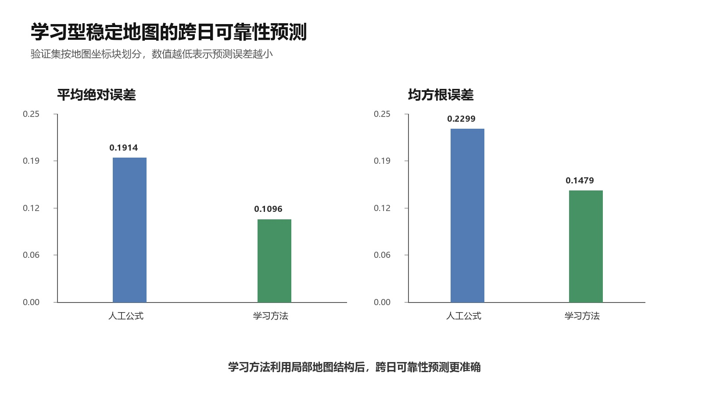
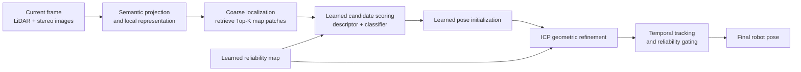
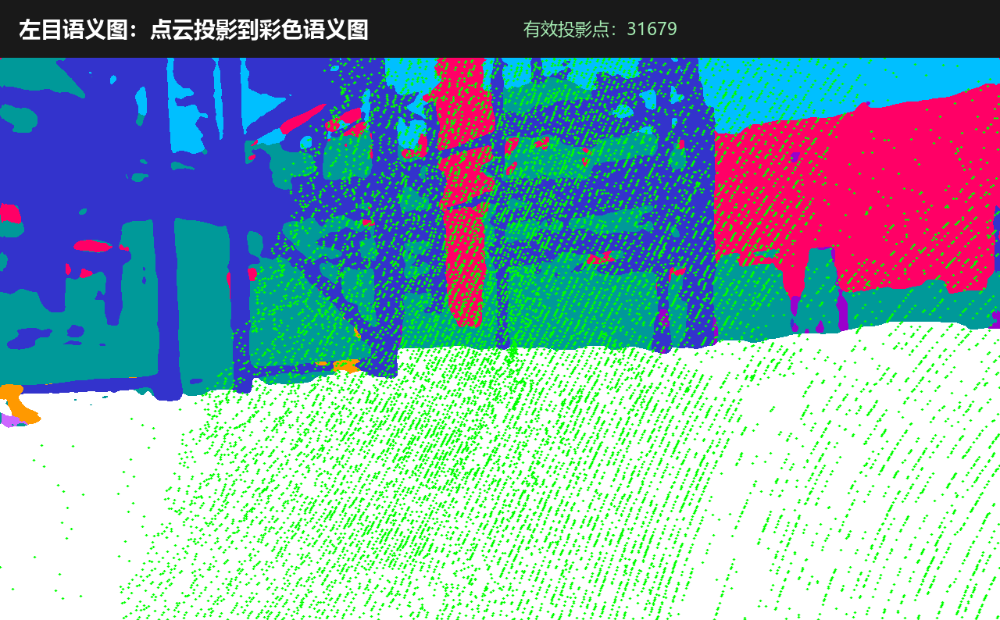
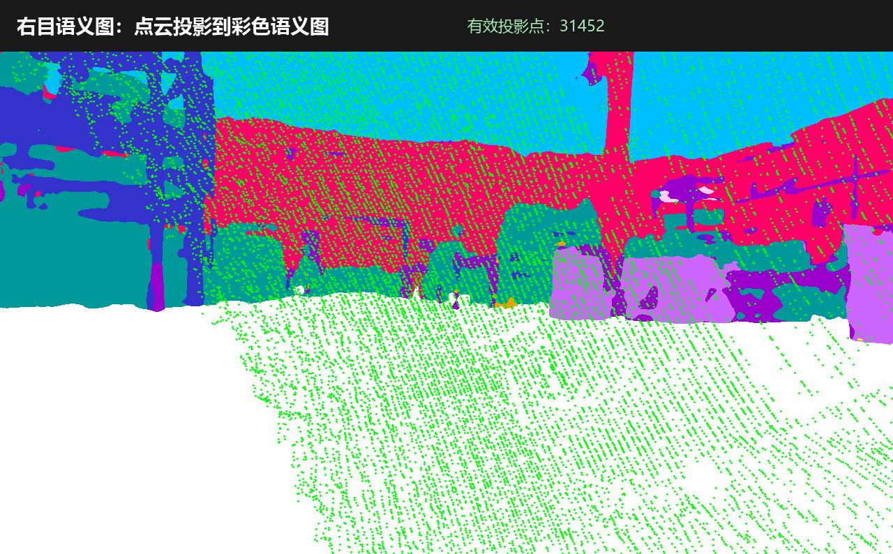

# Cross-Date Warehouse Robot Localization

[中文](README.md) | [English](README_EN.md)

> A coarse-to-fine localization system that helps a mobile robot recover its position in warehouses where shelves repeat, people and carts move, and the environment changes over time.

<p align="center">
  
  
  
  
</p>

## Overview

Warehouse localization is difficult because many aisles look alike and the map is never perfectly static. This project first retrieves a small set of plausible map patches, then combines learned matching, geometric registration, and temporal tracking to estimate the robot pose. A learned reliability map further predicts which parts of the map remain useful across dates.

The deliverable is not a single neural network. It is an end-to-end engineering workflow covering sensor alignment, multimodal representations, candidate retrieval, learned scoring, geometric refinement, failure analysis, ablation studies, and reproducible configurations.

## Results at a Glance

All values use a fixed train/test split. Metric definitions and the complete protocol are available in the [results and reproducibility note](docs/RESULTS_AND_REPRODUCIBILITY.md).

| Component | Evaluation setup | Result | Interpretation |
| --- | --- | ---: | --- |
| Coarse localization | Jun. 15 training → Oct. 12 Aisle_CCW test | **Top-1: 44.26%** | The correct map patch is ranked first |
| Coarse localization | Same split | **Recall@3: 76.72%** | The correct patch is contained in the top three candidates |
| Fine localization | Oct. 12 Aisle_CCW sequence | **0.1086 m** mean position error | 98.47% of frames are below 0.5 m |
| Fine localization | Oct. 12 Aisle_CW sequence | **0.0932 m** mean position error | 99.08% of frames are below 0.5 m |
| Fine localization | Both Aisle routes combined | **0.1002 m** mean position error | 98.80% of frames are below 0.5 m |
| Learned reliability map | Spatially separated cross-date validation | **MAE: 0.1914 → 0.1096** | 42.7% lower error than a hand-designed stability rule |

<p align="center">
  
</p>

## System Design



### 1. Coarse localization: reduce the search space

The current LiDAR scan is converted into a bird's-eye-view representation and compared with map patches built from the June map. The retrieval model learns both global descriptors and a patch-classification score, which helps distinguish visually repetitive shelf aisles.

### 2. Fine localization: learn first, verify with geometry

For the top candidates, a neural model predicts match confidence and an initial relative pose. ICP then refines the pose using local point-cloud geometry. This division of labor avoids both a fragile global ICP search and an opaque learning-only pose estimate.

### 3. Temporal robustness: reject one-frame mistakes

The tracker maintains the current hypothesis and competing hypotheses. A challenger needs consistent evidence across consecutive frames before it can replace the active state. Reliability gates suppress unstable learned initializations when people, carts, or occlusions alter the local observation.

### 4. Learned reliability map: learn where the map is trustworthy

LiDAR points are projected into left and right semantic images, then aggregated into a 0.5 m grid map. A lightweight convolutional model uses local structure, observation density, and semantic statistics to predict whether a region will remain reliable across dates.

<p align="center">
  
  
</p>

<p align="center">
  
  
</p>

## Engineering Challenges Addressed

| Real-world issue | Method | Outcome |
| --- | --- | --- |
| Repeated shelves make global point-cloud alignment ambiguous | Retrieve a small candidate set before local registration | Converts a difficult global search into a controlled two-stage problem |
| People and carts occlude local geometry | Semantic projection, dynamic-region filtering, and temporal gates | Reduces track switches caused by one abnormal frame |
| The map changes between collection dates | Train a map reliability predictor from cross-date observations | Replaces a fixed heuristic with a learnable reliability signal |
| Learned models and geometry have different failure modes | Use learning for ranking/initialization and ICP for final alignment | Preserves interpretability and a geometric fallback |

## AI-Assisted Engineering Practice

This work demonstrates AI as part of an accountable scientific and engineering process:

- Diagnose bottlenecks from error curves, incorrect candidates, and occluded frames, then formulate testable mechanisms.
- Align point clouds, stereo images, semantic masks, and historical maps into a shared representation.
- Keep ablations and negative results to distinguish a better prediction model from a better end-to-end localization result.
- Use generative AI for literature triage, code review, test scaffolding, and documentation support; data splits, experimental hypotheses, training runs, metric verification, and technical decisions remain human-controlled.

## Dataset: TorWIC-SLAM

This project uses the [Toronto Warehouse Incremental Change SLAM Dataset (TorWIC-SLAM)](https://github.com/Viky397/TorWICDataset). It was collected in a Clearpath Robotics warehouse over **three collection days**, spanning **four months**, with **three scenarios** and **twenty trajectories**. The robot follows predefined clockwise and counter-clockwise routes, making the data well suited to cross-date localization under semi-static change.

| Data component | Official files/content | Role in this project |
| --- | --- | --- |
| High-accuracy 3D map | `groundtruth_map.ply`, scanned and registered with a Leica MS60 Total Station | Map-patch generation and pose-error evaluation |
| Stereo RGB images | `image_left/`, `image_right/` | Multimodal appearance and semantic cues |
| RGB-aligned depth images | `depth_left/`, `depth_right/`; `uint16` values are converted to meters with a `0.001` scale | Camera geometry and projection checks |
| Semantic segmentation | Color masks and class-ID masks for both cameras | Dynamic and semi-dynamic object reasoning |
| 3D LiDAR scans | Ouster OS1-128 point clouds in `lidar/` | BEV retrieval, geometric registration, and final localization |
| Timing, IMU, and poses | IMU files, `frame_times.txt`, and `traj_gt.txt` | Synchronization, supervision, and objective evaluation |
| Camera calibration | `calibrations.txt` | Transform LiDAR, stereo images, and semantic labels into a common frame |

The main split in this repository uses **Jun. 15** for map construction and training, **Jun. 23** to build cross-date reliability supervision, and **Oct. 12 Aisle** as a blind test set not used for tuning. The official semantic masks are model-generated rather than perfect frame-by-frame human annotations, so they are treated as auxiliary evidence alongside point-cloud geometry and temporal consistency.

This repository does **not** redistribute raw point clouds, images, depth maps, segmentation masks, calibration files, trajectories, trained weights, or local outputs. Please download the data from the official source and follow its license and usage restrictions.

## Setup and Entry Points

```bash
git clone https://github.com/dddududu/torwic_coarse.git
cd torwic_coarse
uv sync --group dev
```

After downloading TorWIC-SLAM, replace local data paths in the YAML configuration files. Typical entry points are:

```bash
# Train coarse retrieval
python -m trainers.train_coarse_retrieval \
  --config configs/coarse_retrieval_classifier_head_e2_stride10.yaml \
  --output-checkpoint outputs/coarse_retrieval_classifier_head.pt

# Evaluate coarse retrieval
python -m retrieval.evaluate_retrieval \
  --config configs/eval_oct12_aisle_ccw_classifier_head_stride10.yaml \
  --checkpoint outputs/coarse_retrieval_classifier_head.pt \
  --output-json outputs/eval_oct12_aisle_ccw.json

# Run fine localization
python -m localization.deep_fine_localizer \
  --config configs/fine_localization_oct12_aisle_ccw_deep_v6_guidedbev_online.yaml \
  --output-json outputs/fine_localization_oct12_aisle_ccw.json
```

## Repository Guide

| Directory | Contents |
| --- | --- |
| `dataset_io/`, `calibration/`, `geometry/` | Data loading, sensor calibration, and coordinate transforms |
| `retrieval/`, `trainers/`, `models/` | Coarse retrieval, model training, and learned scoring |
| `localization/`, `preprocess/` | Fine localization, ICP, temporal tracking, and dynamic-point processing |
| `configs/` | Reproducible training and evaluation configurations |
| `experiments/` | Date-organized experiment scripts, configurations, and records |
| `tests/` | Unit and regression tests for critical mechanisms |
| `docs/` | Project narrative, metrics, data notes, and experiment index |

## Citation and Acknowledgements

The TorWIC repository requests that users of TorWIC-SLAM or POV-SLAM-related materials cite the following work:

```bibtex
@INPROCEEDINGS{QianChatrathPOVSLAM,
  author={Qian, Jingxing and Chatrath, Veronica and Servos, James and Mavrinac, Aaron and Burgard, Wolfram and Waslander, Steven L. and Schoellig, Angela},
  booktitle={2023 Robotics: Science and Systems (RSS)},
  title={{POV-SLAM: Probabilistic Object-Level Variational SLAM}},
  year={2023}
}
```

I thank the TorWIC/POV-SLAM authors for releasing the data and documentation, the Vector Institute for Artificial Intelligence and the NSERC Canadian Robotics Network (NCRN) for supporting the original work, and Clearpath Robotics for providing the facility and robot platform. This is an independent implementation built on the public dataset and is not affiliated with or endorsed by the dataset authors or those organizations.

---

If this project is relevant to your work in robot localization, map maintenance, or multimodal AI systems, feel free to get in touch.
