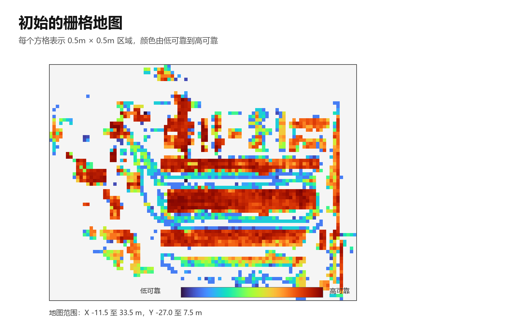
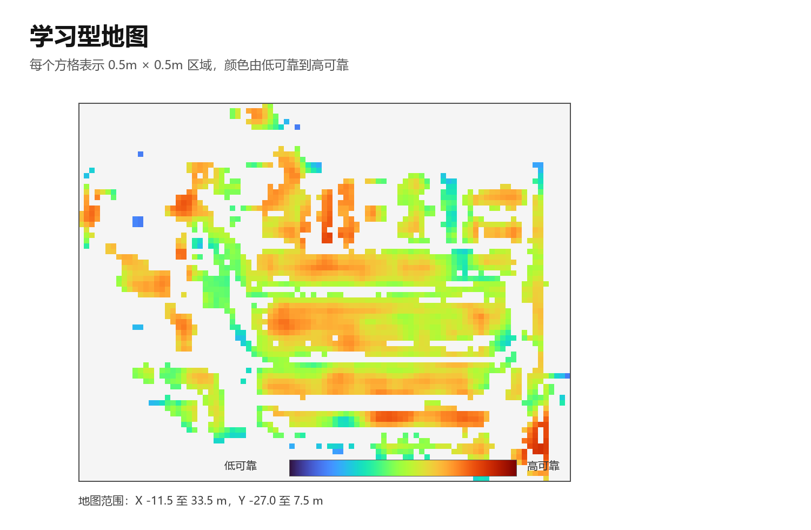
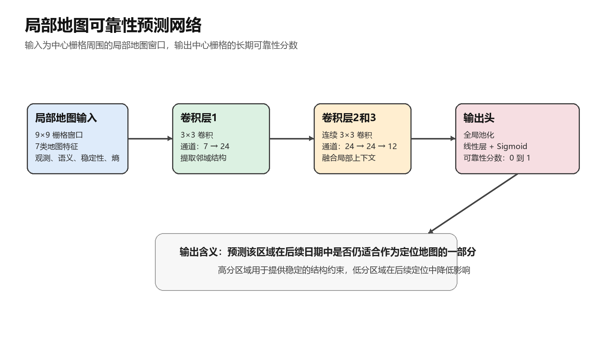

# 结果、数据与复现说明

## 评测协议

本项目严格区分地图构建/训练、跨日监督和最终测试：

| 阶段 | 使用日期 | 用途 |
| --- | --- | --- |
| 地图与主要训练 | Jun.15, 2022 | 建图、粗定位与精定位模型训练 |
| 地图可靠性监督 | Jun.23, 2022 | 仅用于构造“跨日后是否仍可靠”的监督信号 |
| 最终盲测 | Oct.12, 2022 | Aisle_CCW 与 Aisle_CW 测试；不参与训练或调参 |

学习型稳定地图的验证进一步按**地图空间块**而不是随机样本划分，降低相邻栅格信息泄漏的风险。

## 核心结果

### 粗定位

测试配置：Jun.15 多路线训练、Oct.12 Aisle_CCW 测试；地图块步长为 10。

| 方法 | Top-1 | Recall@3 | 含义 |
| --- | ---: | ---: | --- |
| Fine-tune | 39.34% | 74.10% | 基础描述子微调 |
| Stage 2 | 42.30% | 73.11% | 第二阶段训练 |
| Local rerank | 40.98% | 75.63% | 近邻候选局部重排 |
| Classifier head | **44.26%** | **76.72%** | 描述子与候选分类分数融合 |

“Top-1”表示正确地图块被排在第一名的比例；“Recall@3”表示正确块是否出现在前三名。对于后续精定位而言，Recall@3 更直接决定“正确区域有没有被保留下来”，而 Top-1 则决定后续计算是否能更快、更稳定地从正确候选开始。

### 精定位

下表固定已有的候选检索、学习评分和 ICP 位姿后，统计 Oct.12 Aisle 全序列的位置误差：

| 序列 | 帧数 | 平均位置误差 | 中位数 | P95 | 小于 0.5 m |
| --- | ---: | ---: | ---: | ---: | ---: |
| Aisle_CCW | 915 | 0.1086 m | 0.0825 m | 0.2148 m | 98.47% |
| Aisle_CW | 1,092 | 0.0932 m | 0.0727 m | 0.1927 m | 99.08% |
| 合并 | 2,007 | **0.1002 m** | 0.0776 m | 0.2046 m | **98.80%** |

### 学习型地图

| 指标 | 人工公式 | 学习型地图 | 相对变化 |
| --- | ---: | ---: | ---: |
| 跨日可靠性 MAE | 0.1914 | **0.1096** | 降低 42.7% |
| 跨日可靠性 RMSE | 0.2299 | **0.1479** | 降低 35.7% |
| 皮尔逊相关系数 | 0.5026 | **0.5529** | 提高 0.0503 |

这些结果衡量的是“仅根据 Jun.15 初始地图，预测 Jun.23 再次观测时的可靠性”。它说明局部地图结构提供了超出人工公式的可学习信息。

## 数据来源与边界

数据来自官方发布的 [Toronto Warehouse Incremental Change SLAM Dataset（TorWIC-SLAM）](https://github.com/Viky397/TorWICDataset)。官方说明中包含三维 LiDAR、左右 RGB-D 相机、标定文件、轨迹和语义分割结果；数据采集覆盖多次日期与仓库内的半静态变化。

本仓库**不重新分发**以下内容：

- 原始点云、图像、语义图、标定文件和轨迹；
- 本地训练权重、描述子库和运行输出；
- 个人研究日志与机器相关临时文件。

请从官方渠道获取数据，并遵守原始数据集许可、引用和使用限制。下载后，需要在 `configs/` 与 `experiments/` 下的 YAML 中替换本机数据路径。

## 复现环境

- Python 3.12+
- PyTorch 2.9.0（CUDA 12.6 构建）
- NumPy、OpenCV、Pillow、PyYAML

```bash
uv sync --group dev
pytest -q
```

典型入口：

```bash
python -m trainers.train_coarse_retrieval --config configs/coarse_retrieval_classifier_head_e2_stride10.yaml --output-checkpoint outputs/model.pt
python -m retrieval.evaluate_retrieval --config configs/eval_oct12_aisle_ccw_classifier_head_stride10.yaml --checkpoint outputs/model.pt --output-json outputs/eval.json
python -m localization.deep_fine_localizer --config configs/fine_localization_oct12_aisle_ccw_deep_v6_guidedbev_online.yaml --output-json outputs/fine.json
```

## 可视化证据

| 初始的栅格地图 | 学习型地图 |
| --- | --- |
|  |  |


