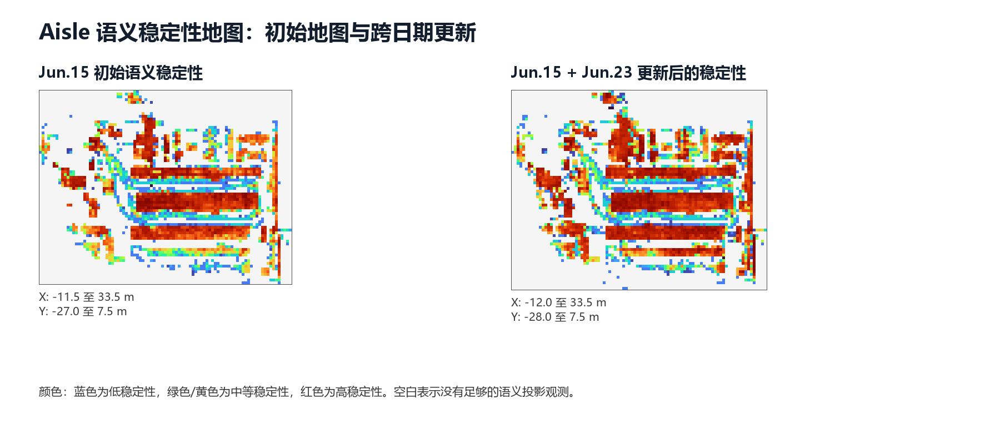
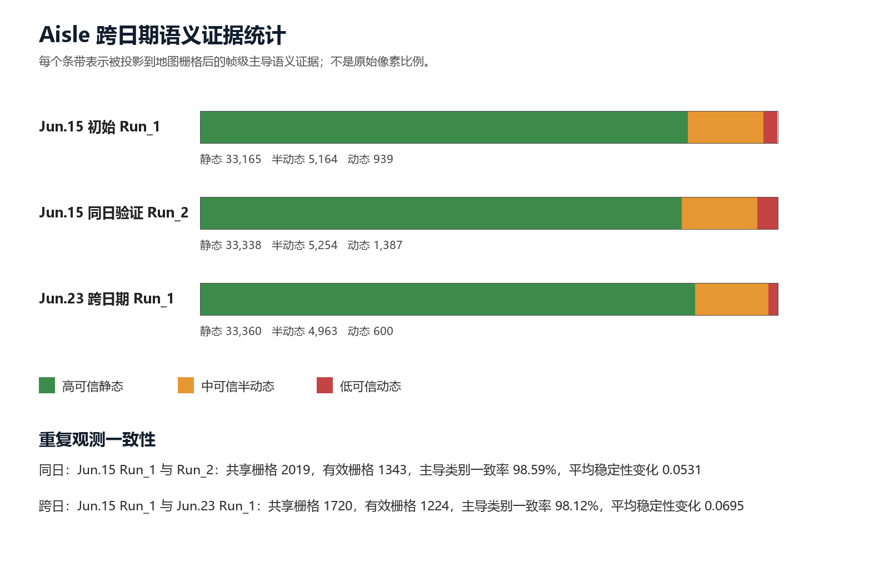
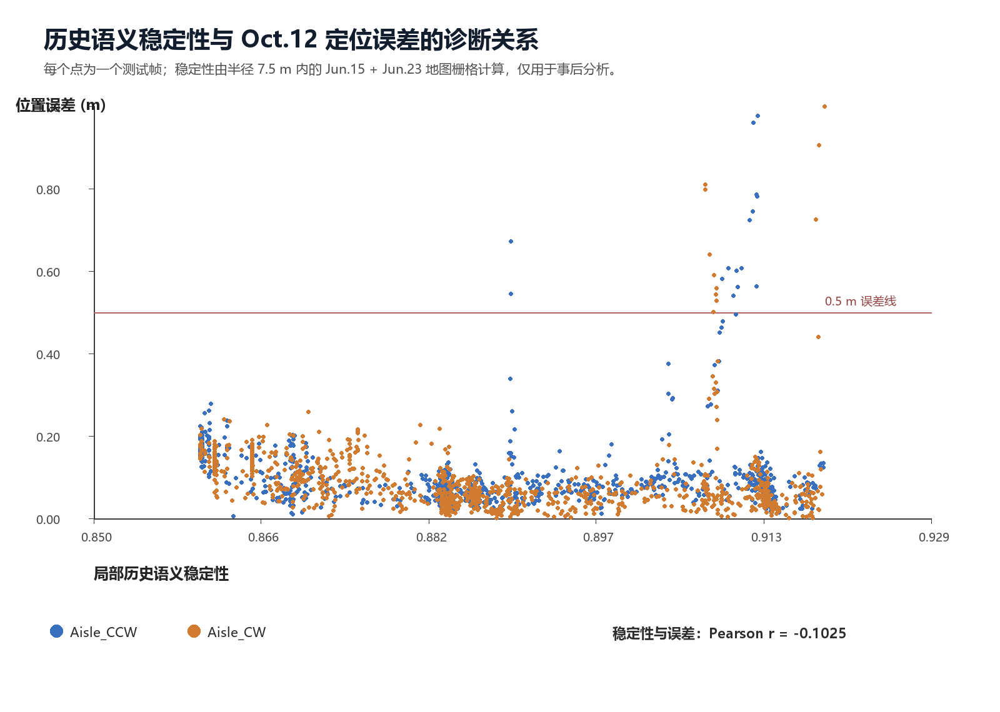

# 研究日志（2026.07.31）：实验一 语义稳定性地图

本实验已完成，完整图文 Word 日志位于 `logs/research_log_experiment1_semantic_stability.docx`。

## 结论

使用 Jun.15 的 Aisle Run_1 构建初始地图、Jun.15 Run_2 做同日验证、Jun.23 Run_1 做跨日期更新后，语义主导类别在同日有效共享栅格上的一致率为 `98.59%`，跨日期仍为 `98.12%`。这证明墙、货架、地面等长期结构能形成稳定的语义地图侧信息。合入 Jun.23 观测后，地图覆盖从 `2318` 个语义栅格扩展到 `2751` 个栅格。

但是，历史地图稳定性与 Oct.12 既有 v14a 定位误差的总体 Pearson 相关系数仅为 `-0.1025`。高稳定性区域中仍出现大误差帧，说明重复货架区虽然长期稳定，却依旧可能具有几何和视觉上的位置歧义。因此，稳定性不应作为机器人当前位置的全局置信度；下一阶段应将其用于 TopK 候选 patch 与当前语义锚点之间的一致性重排。

## 复现

先运行 `build_semantic_stability_map.py` 和 `analyze_stability_localization.py`，再运行 `build_experiment1_research_log.py` 生成 Word 日志。所有统计、图像和中间数据输出到 `outputs/semantic_stability_20260731/experiment1/`，而可提交的日志与图像副本保存在本实验目录中。
