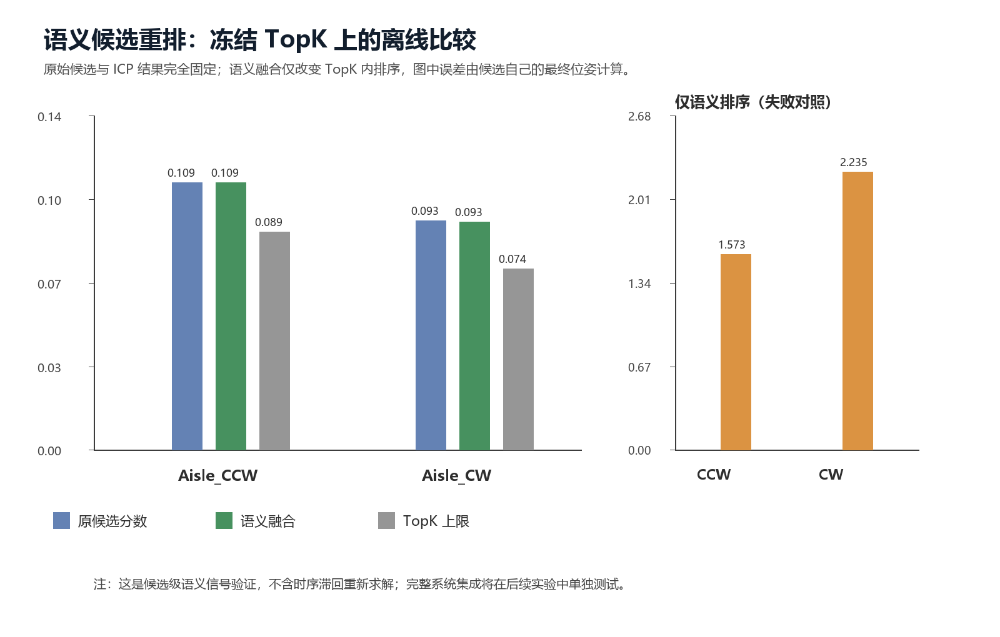

# 研究日志（2026.07.31）：实验二 语义候选重排

完整图文 Word 日志位于 `logs/research_log_experiment2_semantic_candidate_rerank.docx`。

实验固定了现有 v14a 的 TopK 候选与候选 ICP 位姿，仅在候选内部添加由细粒度语义类别和长期稳定性构成的一致性分数。预先固定 `0.20` 的融合权重后，2007 个 Oct.12 Aisle 帧的候选级平均误差从 `0.100241 m` 降至 `0.100038 m`；收益只有 `0.000203 m`，且 CCW 无变化、CW 仅改善 `0.000372 m`。因此，该分数不能作为当前主导机制。

仅按语义排序会使 CCW/CW 平均误差分别恶化到 `1.573 m` 与 `2.235 m`。仓库中的货架、地面和墙柱语义在多个位置重复出现，必须保留几何、深度位姿与时序约束。候选 TopK 本身仍存在显著上限，因而下一步转向学习式可靠性门控，而不是继续增大静态语义分数权重。

