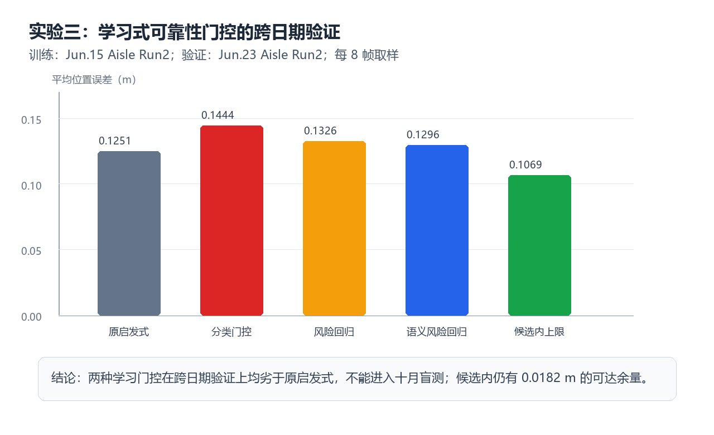

# 实验三：学习式初始化可靠性门控

## 目的

在同一候选 patch 内，以学习方式选择 `BEV`、深度引导或 `tracker` ICP 初始化。训练严格使用 Jun.15 Aisle Run2，验证固定为 Jun.23 Aisle Run2；Oct.12 完全不参与该机制的训练或选择。

## 结果

| 版本 | 验证集平均位置误差 | 相对原策略 | 95 分位误差 | 是否进入盲测 |
|---|---:|---:|---:|---|
| 原启发式 | 0.125069 m | — | 0.187696 m | 基线 |
| 分类门控（16 维） | 0.144407 m | -0.019338 m | 0.527170 m | 否 |
| 风险回归（16 维） | 0.132635 m | -0.007566 m | 0.272747 m | 否 |
| 语义风险回归（19 维） | 0.129586 m | -0.004517 m | 0.187696 m | 否 |
| 候选内 oracle | 0.106854 m | +0.018214 m | — | 上限 |

## 结论

三条 ICP 分支中仍存在可利用的候选内余量，但由单帧几何、深度置信度和双目语义覆盖率构成的轻量门控无法可靠识别会产生大损失的错误切换。模型在 Jun.23 验证上退化，因此不向 Oct.12 盲测传播。下一步转向“候选 patch 正确性 + 多帧静态点子图 + 鲁棒配准”的联合机制。
