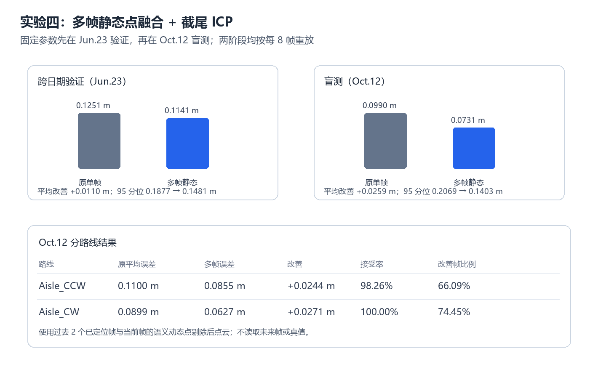

# 实验四：多帧静态点融合与截尾 ICP

## 方法

对当前帧及过去两个已定位采样帧，先用双目语义分割剔除动态点，再依托已有在线位姿变换到世界系并融合。以六月十五日全局地图为目标，执行截尾 ICP，仅保留残差最小的 70% 对应关系；校正量、内点比例和残差必须通过安全门限，否则保留原位姿。

## 结果

| 数据阶段 | 原平均误差 | 多帧静态误差 | 改善 | 原 95 分位 | 多帧 95 分位 |
|---|---:|---:|---:|---:|---:|
| Jun.23 跨日期验证 | 0.125069 m | 0.114106 m | +0.010963 m | 0.187696 m | 0.148116 m |
| Oct.12 Aisle 盲测（每 8 帧） | 0.099035 m | 0.073138 m | +0.025897 m | 0.206944 m | 0.140288 m |

| Oct.12 路线 | 原平均误差 | 多帧静态误差 | 改善 |
|---|---:|---:|---:|
| Aisle_CCW | 0.109958 m | 0.085530 m | +0.024428 m |
| Aisle_CW | 0.089867 m | 0.062736 m | +0.027131 m |

## 结论

该方法先通过 Jun.23 验证再进入 Oct.12，验证和盲测均改善。它当前是使用既有 v14a 在线轨迹的因果重放：仅访问当前与过去帧，但尚未接入主线实时局部化循环。下一步是在线化短时子图缓存，并继续研究语义辅助的长期安全地图更新。
