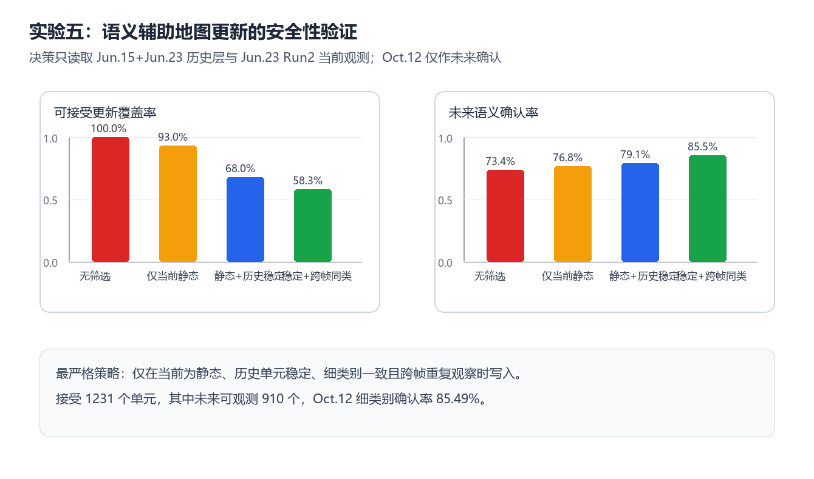

# 实验五：语义辅助地图更新的安全性验证

## 协议

决策仅使用 Jun.15+Jun.23 Run1 建立的历史稳定性层和 Jun.23 Run2 当前观测；Oct.12 Aisle 只作为未来确认。只有当前静态、历史单元稳定、细类别一致且跨帧重复观测的单元，才允许写入长期语义可靠性层。

## 结果

| 策略 | 接受单元 | 当前覆盖率 | Oct.12 可复查单元 | 未来细类别确认率 | 矛盾率 |
|---|---:|---:|---:|---:|---:|
| 无筛选 | 2112 | 100.00% | 1204 | 73.42% | 26.58% |
| 仅当前静态 | 1965 | 93.04% | 1151 | 76.80% | 23.20% |
| 静态+历史稳定 | 1436 | 67.99% | 1035 | 79.13% | 20.87% |
| 稳定+跨帧同类 | 1231 | 58.29% | 910 | 85.49% | 14.51% |

## 结论

严格的延迟确认更新门控以 41.71% 的候选覆盖率代价，将未来细类别确认率提高 12.07 个百分点。长期地图应记录候选证据、延迟吸收静态一致单元，并把动态与半动态语义限制在短期层，避免污染原始几何地图。
